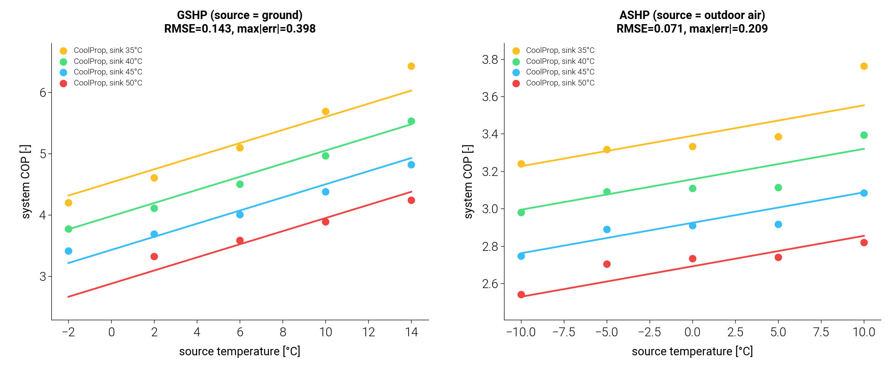

# Affine COP surrogate across heat source / heat sink

`AffineCOPMap` (Rastegarpour et al., *J. Process Control* 99 (2021) 69–78) is a
fast, C-infinity replacement for the expensive CoolProp vapour-compression COP,
for use as an MPC-internal model. It is fit and evaluated purely in terms of two
cycle-end temperatures:

```
COP = a0 + a_src · T_source + a_sink · T_sink      (form "source_sink")
COP = b0 + b_src · T_source                         (form "source")
```

The map does **not** assume which physical stream is the source or the sink.
That assignment is boiler-/unit-/mode-specific and is supplied by a thin
adapter, never by the fit core. This matters because the project is
boiler-centric today but the heat source and heat sink move:

| unit / mode  | `T_source` (evaporator)        | `T_sink` (condenser)        |
| ------------ | ------------------------------ | --------------------------- |
| GSHP heating | ground / brine loop            | tank water / supply         |
| ASHP heating | outdoor air (the unit's `T0`)  | tank water / supply         |
| A2A cooling  | indoor / load air              | outdoor air (heat reject)   |

In cooling the figure of merit is an EER and the source/sink roles swap, but the
parameterisation is identical — a cooling adapter just feeds the (swapped)
temperatures into the same fit core.

## Design — one fit core, per-unit adapters

```
AffineCOPMap.from_grid(cop_fn, t_source_vals, t_sink_vals)   # generic core
    └── cop_fn(T_source, T_sink) -> cop | None               # any unit plugs in here
AffineCOPMap.from_gshpb(gshpb, ...)   # T_source = ground,      T_sink = tank
AffineCOPMap.from_ashpb(ashpb, ...)   # T_source = outdoor air, T_sink = tank
```

`from_grid` sweeps the grid (source outer, sink inner), drops non-converged
(`None`), non-finite, or non-physical (`COP <= 1`) samples, and least-squares
fits the chosen affine form. A future air-to-air / cooling unit needs only a new
adapter; the fit and evaluation code is untouched. This is the same dependency
inversion used by the G1 ground coupler.

## Experiment — same form, two different source streams

`compare_hp_cop_maps.py` fits the **same** affine form against two units whose
source stream is entirely different (GSHP = ground, ASHP = outdoor air), sweeping
the CoolProp cycle over a (source, sink) grid (`Q_ref = 6000 W`, sink ∈
{35, 40, 45, 50} °C).



| unit | fit coeffs (a0, a_src, a_sink) | n | RMSE | max\|err\| |
| ---- | ------------------------------ | - | ---- | ---------- |
| GSHP (source = ground)      | (8.381, **+0.107**, **−0.110**) | 19 | 0.143 | 0.398 |
| ASHP (source = outdoor air) | (5.018, **+0.016**, **−0.047**) | 20 | 0.071 | 0.209 |

Findings:

- **Physical signs hold regardless of the source stream**: `a_src > 0` (a warmer
  source raises COP) and `a_sink < 0` (a hotter tank lowers it) for both units.
- **One affine form covers both units.** ASHP is nearly affine (RMSE 0.071); GSHP
  carries mild curvature (the line slightly over-predicts at low source temp and
  under-predicts at high), so its RMSE is larger at 0.143 — still well inside the
  ~0.5 COP tolerance typical for a receding-horizon MPC internal model.
- The GSHP source sensitivity (`a_src = 0.107 / °C`) is ~6.5× the ASHP one
  (0.016 / °C) over these grids — the ground-loop COP responds far more strongly
  to its source temperature than the air-source unit does to ambient, which is
  exactly why seasonal ground charging (the solar `GSHPB_STC_ground` work) buys
  COP.

## Limits / extension points

- The static fit is **offline, one-shot**. The first-order lag (τ ≈ 60 s) and the
  online recursive-least-squares / Kalman update from Rastegarpour 2021 belong to
  the controller layer and are not implemented here.
- GSHP curvature could be reduced with a `source_sink` + quadratic term or a
  piecewise fit, at the cost of the affine (QP-friendly) structure. Not worth it
  at the current MPC tolerance.
- **Cooling** (EER, swapped source/sink) is not yet exercised — tmhp's cycle is
  heating-mode. When it lands it plugs in as a new `from_*` adapter with no change
  to `from_grid` / `fit` / `cop`.

Run::

    OMP_NUM_THREADS=2 .venv/bin/python docs/cop_map/compare_hp_cop_maps.py
