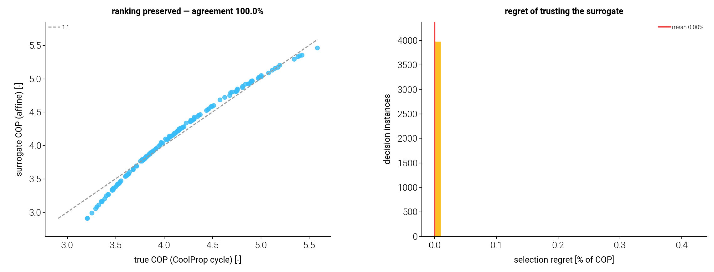

# G2 — is the affine COP surrogate decision-relevant?

Before the MPC (G3) is allowed to optimise against the cheap affine COP map
instead of the expensive CoolProp cycle, the surrogate must be shown to preserve
the **decisions** a controller would make from it — not merely its pointwise COP.
A surrogate can have a visible pointwise error yet still be *decision-adequate* if
it preserves the ordering of operating points and never mis-picks one that costs
much.

`surrogate_eval.py` provides the (unit-agnostic) metrics; `decision_relevance.py`
applies them to a library of 149 real GSHP operating points (CoolProp cycle),
against the offline affine map fit on a coarse 4×3 grid.

## A. Pairwise ordering agreement

For every pair of operating points, does the surrogate agree with the cycle on
which has the higher COP? (Pairs whose true COP gap is below `tol = 0.02` are
controller-indifferent ties and excluded.)

- **Agreement: 10,785 of 10,786 pairs (99.99 %).** The single mis-ranked pair is a
  **0.023-COP near-tie** — just over the tie threshold — so even the lone
  disagreement carries negligible cost. The scatter (left) sits on the 1:1 line
  with only mild curvature at low COP (where the affine map slightly over-predicts,
  matching the GSHP curvature seen in `cop_maps.md`), and that curvature is
  monotone, so the *ordering* is preserved.

## B. Selection regret

A controller selects the operating point (timeslot / tank state) the surrogate
rates best; the regret is the true COP it gives up versus the truly-best point,
aggregated over 4,000 random 6-candidate decision instances:

- **Mean regret 0.00 %**, 95th-percentile 0.00 %, and **99.6 % of decisions are
  zero-regret** (the surrogate picks the truly-best candidate). The handful of
  non-zero cases lose a few thousandths of a COP — near-ties again.

## Conclusion

The affine COP map is **decision-adequate**: it preserves operating-point rankings
(99.99 %) and incurs essentially zero selection regret, so G3 can optimise against
it in the loop with confidence rather than solving the CoolProp cycle every step.
This is the green light for the cycle-in-loop MPC — the affine surrogate (with the
`OnlineCOPMap` adaptation for drift) is a faithful stand-in for control purposes.

## Scope

- Decision-relevance is shown for the **steady COP ranking** that an operating-mode
  / timeslot decision turns on. It does not certify the surrogate for transient
  cycle dynamics (start-up, defrost) — out of scope for a steady-state COP map and
  not part of the receding-horizon decisions G3 makes.
- The metrics in `tmhp.surrogate_eval` are unit-agnostic and reused to validate any
  future surrogate (e.g. a cooling-mode EER map).

Run::

    OMP_NUM_THREADS=2 .venv/bin/python docs/g2_decision_relevance/decision_relevance.py
