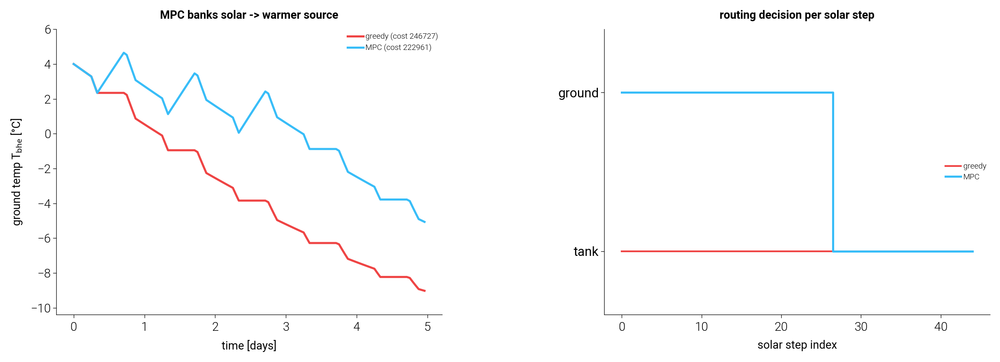

# G3 — economic solar-routing MPC

The greedy router (G1–solar work, `docs/solar_routing`) is myopic: it serves the
tank whenever it is below setpoint and lets the ground deplete, because the payoff
of charging the *ground* instead is deferred — a warmer borehole raises the
heat-pump source temperature and the COP of *future* operation. Only a look-ahead
controller sees that value.

`SolarRoutingMPC` (`tmhp.solar_routing_mpc`) solves the look-ahead exactly by
**finite-horizon dynamic programming** over a lumped ground-temperature state,
using the affine COP map (validated decision-relevant in G2) as the cost model.
The decision each step is the exclusive route `ground`/`tank`/`off`; greedy is the
horizon-1 special case. The plan is injectable into the full plant through
`GSHPB_STC_routed`'s `solar_router`.

## Experiment — DP plan vs greedy on the internal model

`routing_mpc.py` runs a 5-day forecast (standing loss + morning/evening DHW draws,
a 9-hour daytime collector, and a realistic **evening-peak tariff**: night 1.0,
day 1.4, evening 3.2) on the MPC's reduced model. Both controllers run on the same
model, so the difference is purely the routing decision.

| metric                       | greedy | MPC (DP) |        |
| ---------------------------- | ------ | -------- | ------ |
| electricity **cost** (priced)|  246.7k| 222.9k   | **−9.6 %** |
| electricity **energy** [kWh] | 119.24 | 113.79   | −4.6 % |
| solar steps routed to ground |   0    | 102      |        |
| ground temp at end [°C]      |  −9.1  | −5.1     | +4.0 °C warmer |

Findings:

- **The look-ahead banks solar into the ground** (102 steps vs greedy's 0), holding
  the borehole ~4 °C warmer throughout (left panel). Greedy dumps every step into
  the tank and lets the source deplete.
- **The cost saving (9.6 %) exceeds the energy saving (4.6 %)** because the MPC
  targets the expensive evening peak: daytime solar banked in the ground raises the
  COP of the evening DHW-draw operation, which runs at the 3.2× tariff. Greedy's
  immediate daytime tank displacement only offsets cheaper daytime electricity, so
  it cannot anticipate the peak. The MPC optimises the *priced* objective directly.
- **Terminal behaviour is visible and correct** (right panel): the MPC routes to the
  ground while there is future operation to benefit, then switches to the tank near
  the horizon end where no future remains to reward ground charging — the standard
  finite-horizon end effect, which a receding-horizon re-plan removes.

## Scope / honesty

- The comparison is **exact and self-consistent on the reduced linear model**
  (lumped ground + affine COP). That isolates the routing decision's value, but the
  magnitude is conservative: the linear model is nearly indifferent to routing in a
  mild regime and **misses the depletion nonlinearity** — when the source gets cold,
  the true COP collapses far faster than the affine map predicts, so ground charging
  is worth *more* than the linear MPC credits.
- **Full-plant closed-loop validation is deferred.** Injecting the schedule into the
  CoolProp `GSHPB_STC_routed` plant on the small 2×1 test field drives it outside its
  physical envelope (tank > 120 °C, source fluid < −100 °C) under this solar/DHW
  load — the plant numbers there are not trustworthy. A meaningful plant comparison
  needs a properly-sized field and operating-envelope guards.
- Both gaps point the same way: the next step is a **higher-fidelity MPC internal
  model** — the geolink network ground state and a COP model valid into the depleted
  regime — so the controller values ground charging as much as the real plant does.

## Components this composes

G3 is the first piece that ties the program together: the **affine COP map** (G2,
decision-adequate) as the cost model, the **exclusive ground/tank routing** (solar
work) as the decision, and the **ground state** as what makes routing a sequential
problem. `OnlineCOPMap` (drift adaptation) and the geolink network ground coupling
(G1) plug into the same controller as fidelity grows.

Run::

    .venv/bin/python docs/g3_routing_mpc/routing_mpc.py
