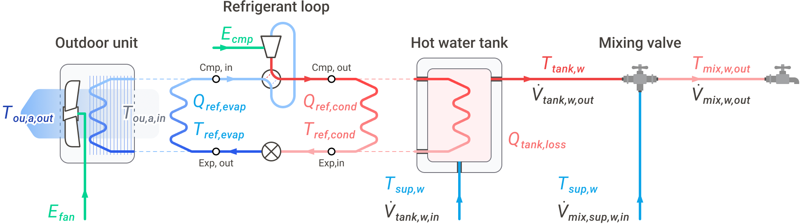

==================
Cycle architecture
==================

Every model in ``physics_hp`` is the same closed refrigerant cycle
wrapped in a different source / sink pairing. This page sketches
the shared structure and shows where each system family plugs in.

The shared core
===============

        evaporator HX with outdoor fan, expander, and tank-side
        flow connections.
    :align: center
    :width: 90%

    The ASHPB schematic. The same compressor / expander / cycle
    closure block reappears in GSHPB, WSHPB, ASHP, and GSHP — only
    the components attached to the evaporator and condenser change.

The cycle solves four refrigerant state points (compressor in,
compressor out, expander in, expander out) plus the evaporator and
condenser saturation states. Heat transfer at each HX is solved
with an ε-NTU model. The evaporating temperature is treated as a
free parameter and chosen by minimising compressor power, so the
cycle closure is a physical optimum rather than a fitted
coefficient.

Source side: where heat comes from
==================================

.. list-table::
    :header-rows: 1
    :widths: 25 35 40

    * - Source
      - Component
      - Model class family
    * - **Air**
      - Outdoor coil + variable-speed fan, ε-NTU air side
      - :doc:`../api/models/ashpb`,
        :doc:`../api/models/space-conditioning`
    * - **Ground**
      - Borehole field, g-function dynamics
      - :doc:`../api/models/gshpb`
    * - **Water**
      - Water loop, prescribed inlet temperature
      - :doc:`../api/models/wshpb`

Sink side: where heat goes
==========================

.. list-table::
    :header-rows: 1
    :widths: 30 70

    * - Sink
      - What's modelled on top of the cycle
    * - **DHW tank**
      - Single-node or stratified tank energy balance, draw
        schedule, mains supply temperature, optional UV treatment.
        Used by every ``*HeatPumpBoiler`` class.
    * - **Building load**
      - Zone temperature / load proxy. Used by
        :class:`~physics_hp.air_source_heat_pump.AirSourceHeatPump`
        and :class:`~physics_hp.ground_source_heat_pump.GroundSourceHeatPump`.

Composed subsystems
===================

The ``*_stc_*`` and ``*_pv_ess`` variants reuse the same core cycle
and add one or more subsystems on the demand side:

- **Solar thermal collector (STC) preheat** — STC heats the mains
  water before it reaches the tank. Reduces the tank-charge duty
  the heat pump has to deliver.
- **STC with stratified tank** — STC charges a separate top node
  of a stratified tank; the heat pump charges the bottom.
- **PV + ESS** — photovoltaic generation feeds an energy storage
  system that supplies the compressor and auxiliary loads
  preferentially.

These are documented under :doc:`../api/support/subsystems`.

Why the structure matters
=========================

Because the cycle is the same code path for every system, a
parameter sweep across refrigerants, source types, or subsystem
combinations doesn't require re-implementing the model — it
requires picking a different class and a different schedule. That
also means the cycle-level invariants (energy balance, COP
definitions, :doc:`failure_reason semantics <failure-reason-semantics>`)
hold identically across the family.
