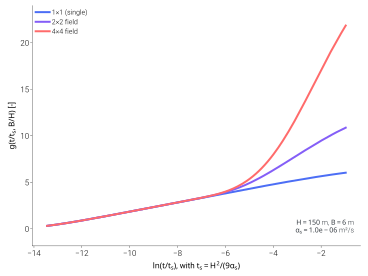

======================================
Ground-source heat pump boiler (GSHPB)
======================================

The ``GSHPB`` family pairs the shared refrigerant cycle with a
ground-loop source side (vertical borehole field) and the same DHW
tank sink as ASHPB.

Overview
========

GSHPB solves the closed refrigerant cycle against a borehole heat
exchanger characterised by a precomputed **g-function**. The class is
:class:`tmhp.GroundSourceHeatPumpBoiler`. Three composed variants
extend it the same way ASHPB's do:

- :class:`tmhp.GSHPB_STC_preheat`
- :class:`tmhp.GSHPB_STC_tank`
- :class:`tmhp.GSHPB_PV_ESS`

Base usage
==========

.. code-block:: python

   from tmhp import GroundSourceHeatPumpBoiler

   gshpb = GroundSourceHeatPumpBoiler(
       ref="R410A",
       N_1=1, N_2=1,      # single borehole
       H_b=150.0,         # depth [m]
   )

   result = gshpb.analyze_steady(
       T_tank_w=55.0,
       T_source=10.0,     # ground-loop fluid inlet [°C]
       Q_ref_cond=8_000,
   )

Source-side mechanics
=====================

For ground-source models, the source-side dynamics are encoded in a
**g-function** — the dimensionless thermal response of a borehole
field to a unit heat-extraction step. ``tmhp`` precomputes the
g-function once via
`pygfunction <https://github.com/MassimoCimmino/pygfunction>`_ and
interpolates it during the simulation, so the per-step cost stays
constant whether the field is one borehole or a hundred.

        field geometries: 1×1, 2×2, and 4×4.
    :align: center
    :width: 100%

    Dimensionless g-function for three rectangular borehole-field
    geometries. The 1 × 1 field is the single-borehole baseline;
    2 × 2 and 4 × 4 diverge as borehole-to-borehole thermal
    interference accumulates over the multi-year horizon. Generated
    by ``scripts/visualization/g_function_curve.py``.

Sink-side mechanics
===================

Same as ASHPB — single-node DHW tank, implicit per-step solve.

Composed variants
=================

Usage patterns for the three variants are identical to ASHPB's —
see :doc:`ashpb` for full STC preheat and PV + ESS examples. Only
the base class swaps; the schedules and routing are unchanged.

STC preheat
-----------

.. autoclass:: tmhp.GSHPB_STC_preheat
    :members:
    :show-inheritance:
    :no-index:

STC with stratified tank
------------------------

.. autoclass:: tmhp.GSHPB_STC_tank
    :members:
    :show-inheritance:
    :no-index:

PV + ESS
--------

.. autoclass:: tmhp.GSHPB_PV_ESS
    :members:
    :show-inheritance:
    :no-index:

API reference
=============

.. automodule:: tmhp.ground_source_heat_pump_boiler
    :members:
    :undoc-members:
    :show-inheritance:

.. automodule:: tmhp.gshpb_stc_preheat
    :members:
    :undoc-members:
    :show-inheritance:

.. automodule:: tmhp.gshpb_stc_tank
    :members:
    :undoc-members:
    :show-inheritance:

.. automodule:: tmhp.gshpb_pv_ess
    :members:
    :undoc-members:
    :show-inheritance:
