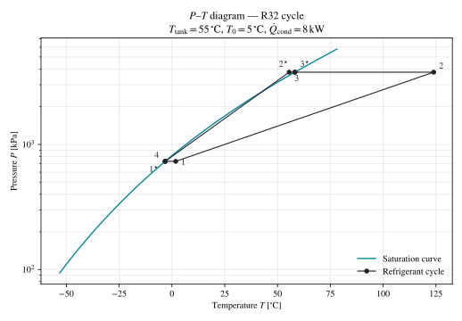

=========================
Visualize the cycle (P–h)
=========================

Every ``analyze_steady`` call returns the full thermodynamic state at
each cycle node (compressor in / out, expander in / out, evaporator /
condenser saturation). Plotting those points on a pressure–enthalpy
chart is the fastest way to sanity-check a solved cycle. The
companion P–T view below shows the same cycle in a different plane.

Both figures are rendered with Matplotlib's built-in ``mathtext`` so
all labels — titles, axis names, and node identifiers — are typeset
in math mode without needing a system TeX installation.

P–h diagram
===========

.. figure:: ../_static/mollier_ph_R32.svg
    :alt: P-h diagram for an R32 ASHPB cycle at T_tank = 55 °C,
        T_0 = 5 °C, Q_cond = 8 kW. Seven cycle nodes labelled
        1, 1*, 2, 2*, 3, 3*, 4.
    :align: center
    :width: 80%

    P–h diagram for an R32 ASHPB cycle at the quickstart operating
    point. The seven labelled nodes follow the library's internal
    naming.

How to read it
--------------

- **Saturation envelope** — blue is saturated liquid, red is
  saturated vapour. The two curves close at the critical point at
  the top of the dome. The interior is two-phase; outside is
  single-phase liquid (left) or vapour (right).
- **Cycle traversal** — follow the labelled nodes in order:

  - :math:`1^{\star} \to 1` — slight superheat at the evaporator
    outlet.
  - :math:`1 \to 2` — compression. Pressure climbs sharply;
    enthalpy increases by the specific work of the compressor.
  - :math:`2 \to 2^{\star}` — de-superheat in the condenser, at
    constant pressure, down to the vapour saturation line.
  - :math:`2^{\star} \to 3^{\star}` — condensation. Horizontal
    segment at the condensing pressure; enthalpy drops as the
    refrigerant releases its latent heat to the water side.
  - :math:`3^{\star} \to 3` — slight subcool.
  - :math:`3 \to 4` — throttling expansion. Enthalpy is preserved
    (:math:`h_4 = h_3`) while pressure drops to the evaporating
    pressure.
  - :math:`4 \to 1^{\star}` — evaporation. Horizontal segment at
    the evaporating pressure; enthalpy climbs as the refrigerant
    absorbs heat from the source side.

The script
----------

The complete script lives at
`scripts/visualization/mollier_ph_R32.py
<https://github.com/bet-lab/physics-heatpump-models/blob/main/scripts/visualization/mollier_ph_R32.py>`_.
The core is a saturation-envelope sweep via CoolProp plus a straight
``ax.plot`` of the seven cycle points returned by ``analyze_steady``:

.. code-block:: python

   import CoolProp.CoolProp as CP
   import matplotlib as mpl
   import matplotlib.pyplot as plt
   import numpy as np

   from physics_hp import AirSourceHeatPumpBoiler

   # Match-the-docs math rendering — no system TeX needed.
   mpl.rcParams["mathtext.fontset"] = "stix"
   mpl.rcParams["font.family"] = "STIXGeneral"

   REF = "R32"
   ashpb = AirSourceHeatPumpBoiler(ref=REF)
   r = ashpb.analyze_steady(T_tank_w=55.0, T0=5.0, Q_ref_cond=8_000.0)

   # Saturation envelope (kJ/kg, kPa) — closed at the critical point
   T_crit = CP.PropsSI("Tcrit", REF)
   P_crit = CP.PropsSI("Pcrit", REF) / 1_000
   T_grid = np.linspace(220.0, T_crit - 0.05, 200)
   h_liq = np.array([CP.PropsSI("H", "T", T, "Q", 0, REF) for T in T_grid]) / 1_000
   h_vap = np.array([CP.PropsSI("H", "T", T, "Q", 1, REF) for T in T_grid]) / 1_000
   p_sat = np.array([CP.PropsSI("P", "T", T, "Q", 0, REF) for T in T_grid]) / 1_000
   h_crit = 0.5 * (h_liq[-1] + h_vap[-1])
   h_liq = np.append(h_liq, h_crit); h_vap = np.append(h_vap, h_crit)
   p_sat = np.append(p_sat, P_crit)

   def hp(h_key, p_key):
       return r[h_key] / 1_000, r[p_key] / 1_000

   pts = {
       "1*": hp("h_ref_evap_sat [J/kg]",   "P_ref_evap_sat [Pa]"),
       "1":  hp("h_ref_cmp_in [J/kg]",     "P_ref_cmp_in [Pa]"),
       "2":  hp("h_ref_cmp_out [J/kg]",    "P_ref_cmp_out [Pa]"),
       "2*": hp("h_ref_cond_sat_v [J/kg]", "P_ref_cond_sat_v [Pa]"),
       "3*": hp("h_ref_cond_sat_l [J/kg]", "P_ref_cond_sat_l [Pa]"),
       "3":  hp("h_ref_exp_in [J/kg]",     "P_ref_exp_in [Pa]"),
       "4":  hp("h_ref_exp_out [J/kg]",    "P_ref_exp_out [Pa]"),
   }

   fig, ax = plt.subplots(figsize=(7.2, 5.0))
   ax.plot(h_liq, p_sat, label="Saturated liquid")
   ax.plot(h_vap, p_sat, label="Saturated vapor")

   path = ["1*", "1", "2", "2*", "3*", "3", "4", "1*"]
   xs = [pts[p][0] for p in path]
   ys = [pts[p][1] for p in path]
   ax.plot(xs, ys, marker="o", label="Refrigerant cycle")

   ax.set_yscale("log")
   ax.set_xlabel(r"Enthalpy $h$ [kJ/kg]")
   ax.set_ylabel(r"Pressure $P$ [kPa]")
   ax.legend()

To regenerate the figure shipped with the docs:

.. code-block:: bash

   uv sync --locked
   uv run python scripts/visualization/mollier_ph_R32.py

The script pins ``mpl.rcParams["svg.hashsalt"]`` so the resulting SVG
is byte-identical across runs — the same convention used by
``scripts/validation/samsung_ehs_parity.py``.

P–T diagram
===========

        sit on top of the saturation curve, with isobaric segments
        collapsed onto two horizontal levels (evaporation and
        condensation).
    :align: center
    :width: 80%

    P–T diagram for the same R32 cycle. Each node carries its
    state-point pressure and temperature directly from
    ``analyze_steady``.

How to read it
--------------

- **Saturation curve** — single curve in (T, P) space, terminating
  at the critical point. Everything below the curve is single-phase
  vapour or supercritical; everything above is single-phase liquid.
- **Cycle shape** — in this projection, the two isobaric segments
  collapse onto a single horizontal level each:

  - The :math:`4 \to 1^{\star}` evaporator branch sits on the low
    pressure :math:`P_{\mathrm{evap}}`.
  - The :math:`2^{\star} \to 3^{\star}` condenser branch sits on
    the high pressure :math:`P_{\mathrm{cond}}`.

  Compression (:math:`1 \to 2`) climbs and warms the refrigerant;
  throttling (:math:`3 \to 4`) drops the pressure adiabatically at
  roughly constant enthalpy.

The script
----------

`scripts/visualization/mollier_pt_R32.py
<https://github.com/bet-lab/physics-heatpump-models/blob/main/scripts/visualization/mollier_pt_R32.py>`_
mirrors the P–h script:

.. code-block:: bash

   uv run python scripts/visualization/mollier_pt_R32.py

The structural difference is the saturation curve — a single
``(T, P_sat(T))`` sweep instead of two enthalpy branches — and the
cycle points are pulled from ``T_ref_*`` and ``P_ref_*`` keys
instead of ``h_ref_*`` and ``P_ref_*``.

Going further
=============

- **Other refrigerants** — change ``REF`` (and re-run
  ``analyze_steady`` with the same operating point) to compare
  cycle shapes across R290, R410A, R134a, etc.
- **Other diagrams** — the library also ships a ``mollier_diagram``
  module with T–h, P–h, and T–s plotters in
  :doc:`../api/support/visualization`. Those use the
  ``dartwork_mpl`` styling layer (not on PyPI), so they're best
  used in environments where you've installed that layer
  separately.
- **Multi-point overlays** — pass several ``analyze_steady``
  results to the same figure to compare cycles at different
  outdoor temperatures or different LWT set-points.
