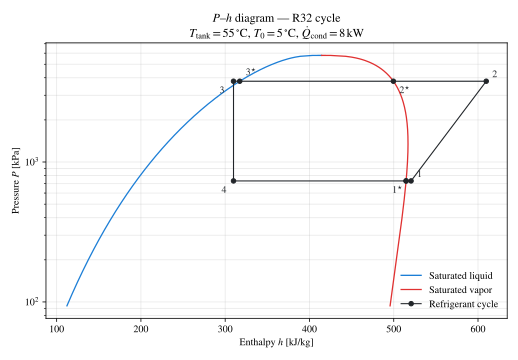

=========================
Visualize the cycle (P–h)
=========================

Every ``analyze_steady`` call returns the full thermodynamic state at
each cycle node (compressor in / out, expander in / out, evaporator /
condenser saturation). Plotting those points on a pressure–enthalpy
chart is the fastest way to sanity-check a solved cycle.

This tutorial draws a P–h diagram with no extra dependencies — just
CoolProp and Matplotlib, which the library already pulls in.

The output
==========

        T_0 = 5 °C, Q_cond = 8 kW. Seven cycle nodes labelled
        1*, 1, 2, 2*, 3*, 3, 4.
    :align: center
    :width: 80%

    P–h diagram for an R32 ASHPB cycle at the quickstart
    operating point. The seven labelled nodes follow the
    library's internal naming.

How to read it
==============

- **Saturation envelope** — blue curve is saturated liquid,
  red curve is saturated vapour. The dome interior is two-phase;
  outside is single-phase liquid (left) or vapour (right).
- **Cycle traversal** — follow the labelled points in order:

  - ``1* → 1`` — slight superheat at the evaporator outlet.
  - ``1 → 2`` — compression. Pressure climbs sharply; enthalpy
    increases by the specific work of the compressor.
  - ``2 → 2*`` — de-superheat in the condenser, at constant
    pressure, down to the vapour saturation line.
  - ``2* → 3*`` — condensation. Horizontal segment at the
    condensing pressure; enthalpy drops as the refrigerant gives
    up its latent heat to the water side.
  - ``3* → 3`` — slight subcool.
  - ``3 → 4`` — throttling expansion. Enthalpy is preserved
    (h₄ = h₃) while pressure drops to the evaporating pressure.
  - ``4 → 1*`` — evaporation. Horizontal segment at the
    evaporating pressure; enthalpy climbs as the refrigerant
    absorbs heat from the source side.

The script
==========

The complete script lives at
`scripts/visualization/mollier_ph_R32.py
<https://github.com/bet-lab/physics-heatpump-models/blob/main/scripts/visualization/mollier_ph_R32.py>`_.
The core is just a saturation-envelope sweep via CoolProp plus a
straight ``ax.plot`` of the seven cycle points returned by
``analyze_steady``:

.. code-block:: python

   import CoolProp.CoolProp as CP
   import matplotlib.pyplot as plt
   import numpy as np

   from physics_hp import AirSourceHeatPumpBoiler

   REF = "R32"
   ashpb = AirSourceHeatPumpBoiler(ref=REF)
   r = ashpb.analyze_steady(T_tank_w=55.0, T0=5.0, Q_ref_cond=8_000.0)

   # Saturation envelope (kJ/kg, kPa)
   T_crit = CP.PropsSI("Tcrit", REF)
   T_grid = np.linspace(220.0, T_crit - 0.5, 200)
   h_liq = np.array([CP.PropsSI("H", "T", T, "Q", 0, REF) for T in T_grid]) / 1_000
   h_vap = np.array([CP.PropsSI("H", "T", T, "Q", 1, REF) for T in T_grid]) / 1_000
   p_sat = np.array([CP.PropsSI("P", "T", T, "Q", 0, REF) for T in T_grid]) / 1_000

   def hp(h_key, p_key):
       return r[h_key] / 1_000, r[p_key] / 1_000

   pts = {
       "1*": hp("h_ref_evap_sat [J/kg]",   "P_ref_evap_sat [Pa]"),
       "1":  hp("h_ref_cmp_in [J/kg]",     "P_ref_cmp_in [Pa]"),
       "2":  hp("h_ref_cmp_out [J/kg]",    "P_ref_cmp_out [Pa]"),
       "2*": hp("h_ref_cond_sat_v [J/kg]", "P_ref_cond_sat_v [Pa]"),
       "3*": hp("h_ref_cond_sat_l [J/kg]", "P_ref_cond_sat_l [Pa]"),
       "3":  hp("h_ref_exp_in [J/kg]",     "P_ref_exp_in [Pa]"),
       "4":  hp("h_ref_exp_out [J/kg]",    "P_ref_exp_out [Pa]"),
   }

   fig, ax = plt.subplots(figsize=(7.2, 5.0))
   ax.plot(h_liq, p_sat, label="Saturated liquid")
   ax.plot(h_vap, p_sat, label="Saturated vapor")

   path = ["1*", "1", "2", "2*", "3*", "3", "4", "1*"]
   xs = [pts[p][0] for p in path]
   ys = [pts[p][1] for p in path]
   ax.plot(xs, ys, marker="o", label="Refrigerant cycle")

   for label, (x, y) in pts.items():
       ax.annotate(label, (x, y), xytext=(6, 6), textcoords="offset points")

   ax.set_yscale("log")
   ax.set_xlabel("Enthalpy [kJ/kg]")
   ax.set_ylabel("Pressure [kPa]")
   ax.legend()

To regenerate the figure shipped with the docs:

.. code-block:: bash

   uv sync --locked
   uv run python scripts/visualization/mollier_ph_R32.py

The script pins ``mpl.rcParams["svg.hashsalt"]`` so the resulting SVG
is byte-identical across runs — the same convention used by
``scripts/validation/samsung_ehs_parity.py``.

Going further
=============

- **Other refrigerants** — change ``REF`` (and re-run
  ``analyze_steady`` with the same operating point) to compare
  cycle shapes across R290, R410A, R134a, etc.
- **Other diagrams** — the library also ships a ``mollier_diagram``
  module with T–h, P–h, and T–s plotters in
  :doc:`../api/support/visualization`. Those use the
  ``dartwork_mpl`` styling layer (not on PyPI), so they're best
  used in environments where you've installed that layer
  separately.
- **Multi-point overlays** — pass several ``analyze_steady``
  results to the same figure to compare cycles at different
  outdoor temperatures or different LWT set-points.
