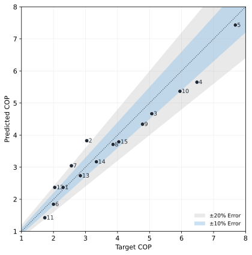

==========
Validation
==========

.. rst-class:: lead

   :class:`~physics_hp.air_source_heat_pump_boiler.AirSourceHeatPumpBoiler`
   has been validated against commercial catalogue data — the
   **Samsung EHS Mono HT Quiet R32 14 kW** unit — across 15
   operating points spanning :math:`T_{\mathrm{LWT}} \in
   \{40, 50, 65\}` °C and outdoor air temperatures from −10 to
   30 °C.

Headline numbers
================

.. grid:: 2 2 4 4
    :gutter: 2
    :class-container: stat-grid

    .. grid-item-card:: MAPE
        :class-card: sd-text-center sd-shadow-none stat-card

        **11.8 %**

        +++

        mean absolute % error
        across 15 points

    .. grid-item-card:: MAE
        :class-card: sd-text-center sd-shadow-none stat-card

        **0.44**

        +++

        mean absolute COP error

    .. grid-item-card:: Operating points
        :class-card: sd-text-center sd-shadow-none stat-card

        **15**

        +++

        LWT 40 / 50 / 65 °C ×
        T₀ −10 to 30 °C

    .. grid-item-card:: Calibration
        :class-card: sd-text-center sd-shadow-none stat-card

        **None**

        +++

        no unit-specific tuning

Parity plot
===========

        operating points of the Samsung EHS Mono HT Quiet R32
        catalogue.
    :align: center
    :width: 70%

    Predicted COP vs catalogue target COP. The 1 : 1 diagonal is
    the reference; points clustered around it indicate the model
    tracks the catalogue without unit-specific calibration.

Per-point comparison
====================

Catalogue conditions and target values follow Table 1 of the
KJACR 2026 paper (see citations below). Predicted values come
from re-running the released code via
``scripts/validation/samsung_ehs_parity.py``.

.. dropdown:: Show all 15 operating points
    :icon: table
    :color: primary
    :animate: fade-in-slide-down

    .. list-table::
        :header-rows: 1
        :widths: 5 12 10 14 14 14 8 10
        :class: validation-table

        * - ID
          - :math:`T_{\mathrm{LWT}}\ [\mathrm{°C}]`
          - :math:`T_0\ [\mathrm{°C}]`
          - :math:`\dot{Q}_{\mathrm{cond}}\ [\mathrm{kW}]`
          - :math:`\mathrm{COP}_{\mathrm{target}}`
          - :math:`\mathrm{COP}_{\mathrm{pred}}`
          - AE
          - APE
        * - 1
          - 40
          - −10
          - 13.45
          - 2.30
          - 2.37
          - 0.07
          - 3.0 %
        * - 2
          - 40
          - 2
          - 12.42
          - 3.04
          - 3.83
          - 0.79
          - 25.8 %
        * - 3
          - 40
          - 12
          - 14.65
          - 5.07
          - 4.67
          - 0.40
          - 7.9 %
        * - 4
          - 40
          - 20
          - 15.69
          - 6.48
          - 5.65
          - 0.83
          - 12.8 %
        * - 5
          - 40
          - 30
          - 16.98
          - 7.68
          - 7.43
          - 0.25
          - 3.2 %
        * - 6
          - 50
          - −10
          - 13.89
          - 2.00
          - 1.84
          - 0.16
          - 7.8 %
        * - 7
          - 50
          - 2
          - 13.27
          - 2.56
          - 3.04
          - 0.48
          - 18.9 %
        * - 8
          - 50
          - 12
          - 14.76
          - 3.86
          - 3.71
          - 0.15
          - 3.9 %
        * - 9
          - 50
          - 20
          - 15.97
          - 4.78
          - 4.34
          - 0.44
          - 9.2 %
        * - 10
          - 50
          - 30
          - 17.48
          - 5.95
          - 5.37
          - 0.58
          - 9.8 %
        * - 11
          - 65
          - −10
          - 13.96
          - 1.83
          - 1.43
          - 0.40
          - 22.1 %
        * - 12
          - 65
          - 2
          - 13.59
          - 2.27
          - 2.38
          - 0.11
          - 4.9 %
        * - 13
          - 65
          - 12
          - 15.55
          - 3.22
          - 2.81
          - 0.41
          - 12.7 %
        * - 14
          - 65
          - 20
          - 16.76
          - 3.83
          - 3.23
          - 0.60
          - 15.7 %
        * - 15
          - 65
          - 30
          - 18.27
          - 4.72
          - 3.84
          - 0.88
          - 18.6 %
        * -
          -
          -
          -
          - **Mean**
          -
          - **0.44**
          - **11.8 %**

Notation
========

- :math:`T_{\mathrm{LWT}}` — Leaving Water Temperature, the
  manufacturer's catalogue reference. The model's tank temperature is
  set 2.5 K below :math:`T_{\mathrm{LWT}}` for
  :math:`T_{\mathrm{LWT}} \le 60` °C and 5 K below for
  :math:`T_{\mathrm{LWT}} > 60` °C, per the paper's EWT / LWT offset.
- :math:`T_0` — outdoor (dead-state) air temperature.
- :math:`\dot{Q}_{\mathrm{cond}}` — target condenser heat rate.
- :math:`\mathrm{COP}` — system Coefficient of Performance,
  :math:`\dot{Q}_{\mathrm{cond}} / (E_{\mathrm{cmp}} + E_{\mathrm{fan}})`.
- AE — Absolute Error,
  :math:`\left|\mathrm{COP}_{\mathrm{pred}} - \mathrm{COP}_{\mathrm{target}}\right|`.
- APE — Absolute Percentage Error,
  :math:`\mathrm{AE} / \mathrm{COP}_{\mathrm{target}}`.
- MAE / MAPE — mean of AE / APE over all 15 points.

Reproducibility
===============

The parity plot and the table above are regenerated by
`scripts/validation/samsung_ehs_parity.py
<https://github.com/bet-lab/physics-heatpump-models/blob/main/scripts/validation/samsung_ehs_parity.py>`_,
so anyone can rerun the comparison from the source.

.. code-block:: bash

   uv sync --locked
   uv run python scripts/validation/samsung_ehs_parity.py

The script:

- Iterates over the 15 catalogue operating points hard-coded
  from Samsung's TDB Table 1.
- Calls ``AirSourceHeatPumpBoiler(ref="R32").analyze_steady(...)``
  at each point.
- Writes a publication-quality SVG to
  ``docs/source/_static/validation_parity.svg`` with a pinned
  ``svg.hashsalt`` so the output is byte-identical across runs.

Scope
=====

.. admonition:: What has — and hasn't — been benchmarked
    :class: note

    Only ``AirSourceHeatPumpBoiler`` has been quantitatively
    validated against catalogue data. The other system classes
    (:class:`~physics_hp.ground_source_heat_pump_boiler.GroundSourceHeatPumpBoiler`,
    :class:`~physics_hp.water_source_heat_pump_boiler.WaterSourceHeatPumpBoiler`,
    :class:`~physics_hp.air_source_heat_pump.AirSourceHeatPump`,
    :class:`~physics_hp.ground_source_heat_pump.GroundSourceHeatPump`,
    and the subsystem-augmented variants) share the same
    refrigerant-cycle core and pass smoke tests on representative
    operating points, but they have not yet been benchmarked
    against unit-specific data.

The accuracy reported here is achieved **without unit-specific
calibration** — the same code path applies to any CoolProp
refrigerant and any operating envelope the cycle can physically
close in.

Citations
=========

- Jo, H. & Choi, W. *"Thermodynamic Modeling of Refrigerant Cycle
  in an Air-Source Heat Pump Boiler and Performance Validation"*,
  KJACR (2026, in press).
- Samsung Electronics, *EHS Mono HT Quiet R32 Technical Data
  Book* (2024) —
  `PDF
  <https://www.theheatpumpwarehouse.co.uk/wp-content/uploads/2024/11/tdb-ehs-mono-ht-quiet-for-europe-r32-50hz-hp-ver.2.1-221005-compressed-compressed.pdf>`_.
